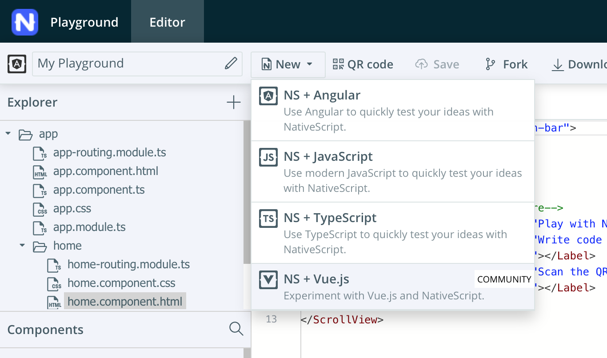
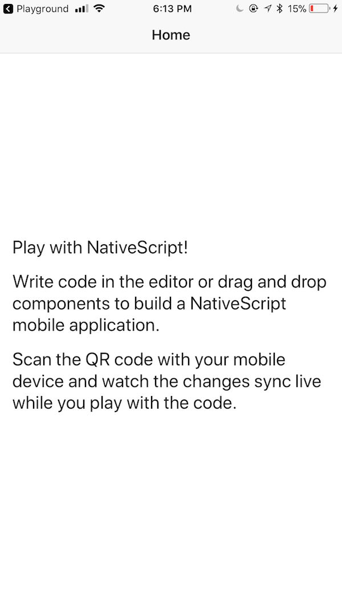
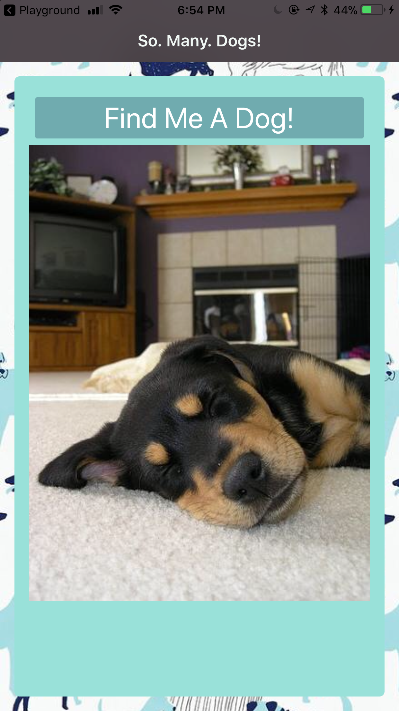

# Mini Workshop 2: 📱 Build A Simple Pet Display Mobile App

| **Project Goal**              | Build a NativeScript-Vue mobile app to display random pets                                                                                                                                                                                                                                |
| ----------------------------- | ----------------------------------------------------------------------------------------------------------------------------------------------------------------------------------------------------------------------------------------------------------------------------------------- |
| **What you’ll learn**         | How to build a mobile app with NativeScript and Vue.js, how to make external API calls and have data display in the app.                                                                                                                                                                  |
| **Tools you’ll need**         | A modern browser like Chrome. Access to the [NativeScript Playground](http://play.nativescript.org) - consider creating an account in the Playground to keep the versions of your work intact. A mobile phone (iOS or Android) with the NativeScript Playground and Viewer apps installed |
| **Time needed to complete**   | 20 minutes                                                                                                                                                                                                                                                                                |
| **Just want to try the app?** | [Open this link in the Playground App](https://play.nativescript.org/?template=play-vue&id=5ev7Vz&v=4)                                                                                                                                                                                    |

# Instructions

## Scaffold your app

Open the [NativeScript Playground](http://play.nativescript.org) and take a look around. On your first visit, you'll see several 'coach marks' showing where key functionality is kept.



Click 'Play Now' to open the main editor. You'll see a QR code appear - scan that with the NativeScript Play app. This allows your phone to refresh automatically as you code. Now you're ready to scaffold a NativeScript-Vue app!

By default, the first playground app is created using Angular. Click 'new' at the top and choose 'NS-Vue' as a template. You'll get another QR code, so scan that one. You'll see your phone refresh and a basic app appear:



## Add some Styles

Now we're going to style the app's interface and build its UI. It's going to have an ActionBar, a card, and a button.

We're going to add an image to a new `/images` folder for the app's background. Click the '+' button in the top panel and create a new folder called images. Download the file below to your local computer. Click the '+' button again and then 'upload resources' to browse and add this file (`bg.jpg`) in that folder. Make sure to save your file.


Next, open the app.css file in the app root. Overwrite the file with these styles:

```css
Page {
  background-image: url('~/images/bg.jpg');
}

.action-bar {
  background-color: #32292f;
  color: #f0f7f4;
  font-size: 20px;
}
.btn {
  background-color: #70abaf;
  color: white;
  padding: 10px;
  margin: 20px;
  font-size: 30px;
  border-radius: 5px;
}
.card {
  vertical-align: top;
  margin: 15;
  padding: 15;
  border-radius: 5;
  background-color: #99e1d9;
}

.placeholder {
  height: 100%;
}
```

As your app refreshes, you'll see that the UI shows some promise, but looks a little strange. Let's fix the UI.

## Fix the UI

Let's fix the ActionBar: In `app/components/HelloWorld.js`, delete everything between the `<Page>` tags. Add a title to ActionBar, something like this: `<ActionBar title="So. Many. Dogs!" class="action-bar" />`.

Next, add a StackLayout to replace the current scrollview. Under the ActionBar, and above the closing `</Page>` tag, add a layout with a button:

```html
<StackLayout class="card">
    <Button class="btn" @tap="getADog">Find Me A Dog!</button>

</StackLayout>
```

Now, you should see a nice looking green card with a darker green button.

::: tip 💡
NativeScript layouts differ from the html you write on the web. You're using NativeScript XML markup, which translates to native UI like GridLayouts and StackLayouts.
:::

## Add Some Data

At this point, we need to start populating our UI with some data. To make external http calls, we need to leverage the http module, so add this line right under the `<script>` tag in HelloWorld.vue (above `export default`):

`const http = require("http");`

Then, edit the `data` block, adding a placeholder for a dog image that will be populated shortly by data from the Dog CEO API.

```js
data() {
    return {
      dogImage: {}
    }
  },
```

Finally, create a space for the image to populate. Under the Button tag and above the last closing `</StackLayout> tag, add this block:

```html
 <StackLayout class="placeholder">
      <Image :src="dogImage.message" />
 </StackLayout>
```

::: tip 💡
Note, if at any time your app stops refreshing on your device, try rescanning the QR code by pressing the "Preview" button. Watch for errors in the console of the Playground.
:::

## Make the Call

The last thing we have to do is add a method to call the Dog CEO API so we can populate our card with data when we press the button. We're going to query this API for random data.

Add a `methods` section under the final comma of the `data` block:

```js
methods: {
    getADog() {
      http.request({ url: "https://dog.ceo/api/breeds/image/random", method: "GET" }).then((response) => {
        this.dogImage = JSON.parse(response.content)
        console.log(this.dogImage.message)
      }, (e) => {
        alert("error")
      });
    }

  }
```

Try pressing the button and seeing if dogs appear. Cute, right? Check the console to see if the dog image urls are being logged, if you encounter any difficulty.

The entire code of your HelloWorld.vue file should look like this:

```js
const Vue = require("nativescript-vue");
const http = require("http");

new Vue({
  data() {
    return {
      dogImage: {}
    }
  },
  template: `
    <Page class="page">
      <ActionBar title="So. Many. Dogs!" class="action-bar" />
      <StackLayout class="card">
        <Button class="btn" @tap="getADog">Find Me A Dog!</button>
           <StackLayout class="placeholder">
            <Image :src="dogImage.message" />
          </StackLayout>
        </StackLayout>
    </Page>
</template>

<script>

  const http = require("http");

  export default {

  data() {
    return {
      dogImage: {}
    }
  },

  methods: {
    getADog() {
      http.request({ url: "https://dog.ceo/api/breeds/image/random", method: "GET" }).then((response) => {
        this.dogImage = JSON.parse(response.content)
        console.log(this.dogImage.message)
      }, (e) => {
        alert("error")
      });
    }
  }
}
</script>
```

The final app looks like this:



It's really interesting to build Vue.js apps for mobile devices in the NativeScript playground. Now that you know how, what else can you build?
