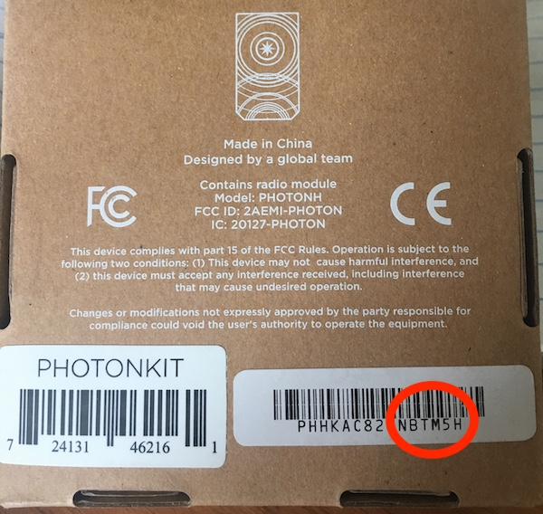
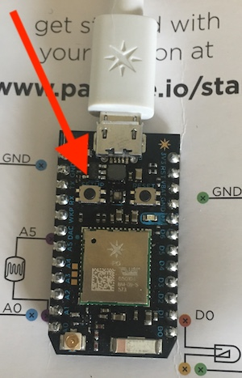
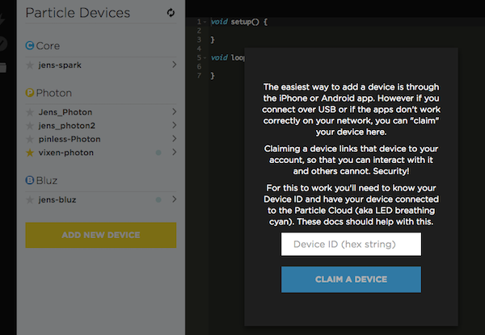
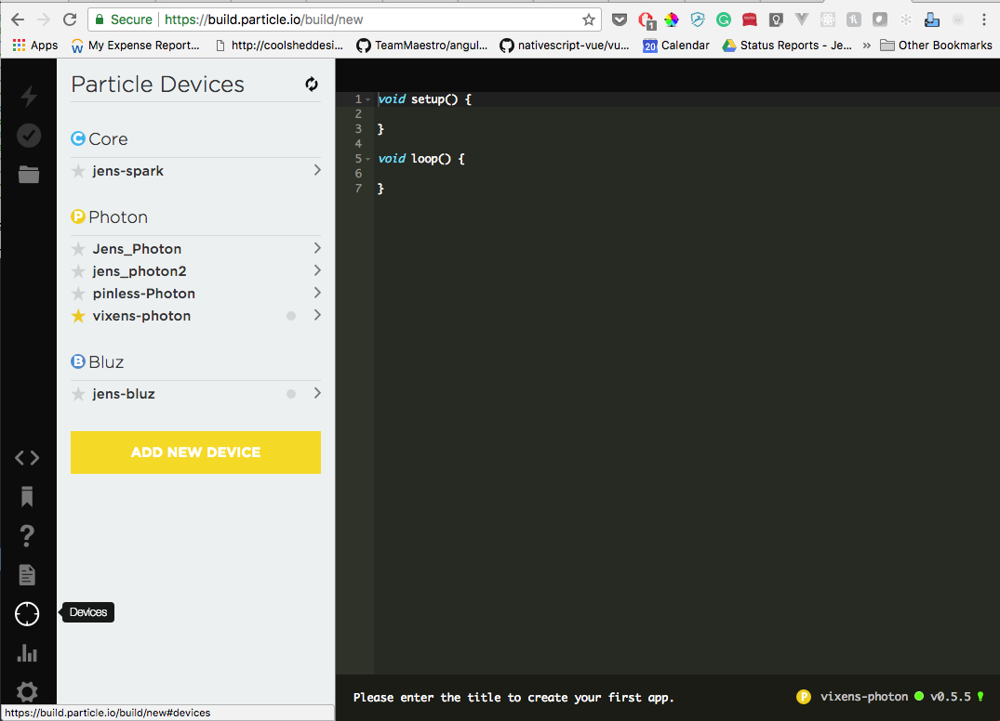
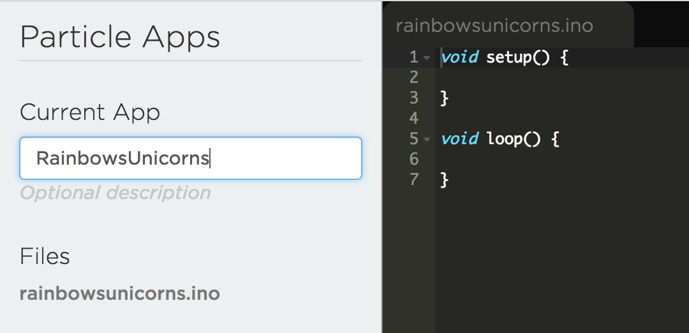
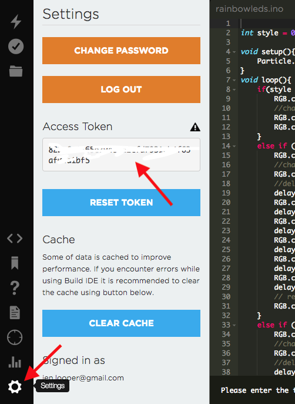

# Mini Workshop 3: 🌈🦄⚡️📱 Build a Rainbow/Unicorn Mobile App that Lights Up a Particle Photon Device

| **Project Goal**            | Build a NativeScript-Vue mobile app to make a Photon's built-in LED flash different colors based on user selection.                                                                                                                                   |
| --------------------------- | ------------------------------------------------------------------------------------------------------------------------------------------------------------------------------------------------ |
| **What you’ll learn**       | How to build a mobile app with NativeScript and Vue.js, how to setup and configure a Particle Photon, and how to connect the two so the app controls the device.                                                                                             |
| **Tools you’ll need**       | Access to Wifi<br><br>A modern browser like Chrome.<br><br>Access to the [NativeScript Playground](http://play.nativescript.org) - consider creating an account in the Playground to keep the versions of your work intact. A mobile phone (iOS or Android) with the NativeScript Playground and Preview apps installed.<br><br>The two NativeScript companion apps for the playground (NativeScript Viewer and NativeScript Playground. On Android: [NativeScript Playground](https://play.google.com/store/apps/details?id=org.nativescript.play) and [NativeScript Preview](https://play.google.com/store/apps/details?id=org.nativescript.preview). On iOS: [NativeScript Playground](https://itunes.apple.com/us/app/nativescript-playground/id1263543946) and [NativeScript Preview](https://itunes.apple.com/us/app/nativescript-preview/id1264484702)<br><br>A [Particle Photon device](https://store.particle.io/collections/photon).|
| **Time needed to complete** | 1 hour  
| **Just want to try the app?** | [Open this link in the Playground App](https://play.nativescript.org/?template=play-vue&id=E9hBGf&v=21)          

# Instructions

## Set Up Your Photon

### 1. Connect the Photon to WiFi:

Unbox the kit that comes with this workshop or use your own device, and plug the mini-USB cord into the Photon and to a USB port on your computer so it will have power. 

- Visit the Photon setup page to set up your device. You will be prompted to login; go ahead and create a Particle account. 

- Click 'Setup a Photon' and 'next' to begin. If you have all the requirements on the next page, click 'next'. Download the local file that is generated to your computer. Open the photonsetup.html file in a browser.

- Identify your Photon by looking at the back of the Photon's box. You'll find a sticker on the right that lists the device's id. The last six characters of that number match the wifi address that appears on your computer. 



- Follow the steps listed to connect to the Photon's wifi network. When it connects, it should 'breathe cyan' (the blue light in the center should pulse gently on and off).


Complete the setup of the device by giving it a name. Now, you can start using your device with Particle Build, the Photon's special IDE where you keep its code.

::: troubleshooting 💡 
Sometimes students have trouble finding their Photon on Particle Buid. If you don't see it in the IDE, add it manually.

- If the device is not already blinking blue, hold down the setup button on the Photon until the main status LED blinks dark blue. This takes about 3 seconds.



- Connect to your Photon's wifi following the steps above, and then open a web browser and navigate to: [http://192.168.0.1/device-id](http://192.168.0.1/device-id). On that page, you'll see an id like this:

```
{"id":"30003F000347363339343638","c":"1"}
```

- Make a note of that id, you'll use it later.

- Navigate to [Particle Build](https://build.particle.io) and click 'Add New Device'. 



- Input the Device ID that you notated earlier in the box. Your device should now be ready to use in the IDE.
:::

### 2. Create a Particle Account and Learn About Particle Build

Create an account [here](https://login.particle.io/login) and then go to [Particle Build](https://build.particle.io/build/new). Click on the third icon from the bottom to see your device listed. Make sure that it is starred - you are going to flash code to this device over wifi.

Let's take a look at Particle Build. This is a browser-based IDE that allows you to 'flash', or publish, code from the browser to the Photon device selected on the left.



Currently, there is nothing in this new file except a setup() and loop() function. Let's start adding code to this file.

::: tip 💡
Photons are basically wifi-connected Arduinos, so if you have experience in Arduino development, this code will look familiar. Arduino 'sketches', or firmware that is written to a hardware device, are commonly written in C or C++. We're going to write a bit of C++ to control the central LED light on the device, avoiding any soldering or extra wiring. The Particle kit, however, comes with a few extras, so feel free to explore them more!
:::

Right now, your Photon is lit up in the center LED, and is 'breathing cyan' or pulsing a kind of greenish blue color, if everything is going well. Let's flash some code to it to turn the central light white.

### 3. Flash Some Code

Inside the loop() function's curly brackets, paste the following code:

```js
RGB.control(true);
//change its color
RGB.color(RGB_COLOR_WHITE);
RGB.control(false);
```

This code uses the Particle API to grab control of the central RGB LED, change its color, then relinquish control.

This new file is considered to be an 'app' in Particle Build. You need to give it a name in the left panel before you can flash code to it.



Save your change by clicking the folder icon in the left navigation strip of Particle Build. Above that, click the circled checkmark to 'verify' the code. This basically tests your code to ensure that it can compile. Finally, ensuring that your Photon is starred, click the lightning icon at the top to flash this code to your device. The Photon should update, and then the central LED should turn white. It will stay white because we put the code in the loop function.

Tinker a little bit with this snippet. Can you turn the LED red?

### 4. Complete the Photon Code

In our mobile app, we're going to create three 'modes' of LED lights - 'Rainbow Mode' where the LED will flash a rainbow series, 'Unicorn Mode' where the LED flashes alternating blue and white, and a 'stop' mode where the LED stays white.

You might have guessed that we're going to put these routines in the loop() function. 

Add a variable at the top of this file, listing the initial light style to be 0:

`int style = 0;`

Then, in the loop() function, overwrite the snippet you just added with the following code:

```js
if(style == 0){
        RGB.control(true);
        //change its color
        RGB.color(RGB_COLOR_WHITE);
        RGB.control(false);
    }
    else if (style == 1){
        RGB.control(true);
        //change its color
        RGB.color(RGB_COLOR_RED);
        //delay a second
        delay(500);
        RGB.color(RGB_COLOR_ORANGE);
        delay(500);
        RGB.color(RGB_COLOR_YELLOW);
        delay(500);
        RGB.color(RGB_COLOR_GREEN);
        delay(500);
        RGB.color(RGB_COLOR_BLUE);
        delay(500);
        RGB.color(RGB_COLOR_MAGENTA);
        delay(500);
        // resume normal operation
        RGB.control(false);
    }
    else if (style == 2){
        RGB.control(true);
        //change its color
        RGB.color(RGB_COLOR_WHITE);
        //delay a second
        delay(500);
        RGB.color(RGB_COLOR_MAGENTA);
        delay(500);
        // resume normal operation
        RGB.control(false);
    }
```

Verify this code and flash it to your device. Nothing seems to have changed - and that's because you have your style set to 0, which is still white. Change the integer value to 1, flash it to device, and see what happens. Do you see a rainbow?

Now you can return the style to 0 so the LED will initialize white:

`int style = 0;`

### 5. Get Ready for the Mobile App to use Photon's REST API

Now, we need to use Photon's cool REST API functionality to allow our mobile app to control the Photon. To do this, add this line to the setup() function, between the curly brackets:

`Particle.function("launchMode",launchMode);`

We just added a Particle function called `launchMode` that will be available from the mobile app, and will call a similarly-named function in the Photon's code.

Add that function under the close of the loop() function:

```js
int launchMode(String mode) {
    style = 0;

    if(mode=="rainbow"){
        style = 1;
    }else if(mode=="unicorn"){
        style = 2;
    }
}
```

Now, our mobile app can call the `launchMode` Particle Function which will call the internal `launchMode` function, passing in a string telling which mode we want to use to dictate the LED flash style.

Go ahead and save, verify, then flash this code to your device. The LED should return to white.

### 6. Final Photon Code

The final code looks like this:

```js
int style = 0;

void setup(){
    Particle.function("launchMode",launchMode);
}
void loop(){
    if(style == 0){
        RGB.control(true);
        //change its color
        RGB.color(RGB_COLOR_WHITE);
        RGB.control(false);
    }
    else if (style == 1){
        RGB.control(true);
        //change its color
        RGB.color(RGB_COLOR_RED);
        //delay a second
        delay(500);
        RGB.color(RGB_COLOR_ORANGE);
        delay(500);
        RGB.color(RGB_COLOR_YELLOW);
        delay(500);
        RGB.color(RGB_COLOR_GREEN);
        delay(500);
        RGB.color(RGB_COLOR_BLUE);
        delay(500);
        RGB.color(RGB_COLOR_MAGENTA);
        delay(500);
        // resume normal operation
        RGB.control(false);
    }
    else if (style == 2){
        RGB.control(true);
        //change its color
        RGB.color(RGB_COLOR_WHITE);
        //delay a second
        delay(500);
        RGB.color(RGB_COLOR_MAGENTA);
        delay(500);
        // resume normal operation
        RGB.control(false);
    }
}

int launchMode(String mode) {
    style = 0;

    if (mode=="rainbow") {
        style = 1;
    } else if (mode=="unicorn") {
        style = 2;
    }

}
```

## Scaffold your app

Now we are going to build an app with NativeScript, using JavaScript to create a native mobile app.

Open the [NativeScript Playground](http://play.nativescript.org) and take a look around. On your first visit, you'll see several 'coach marks' showing where key functionality is kept.

Click 'Play Now' to open the main editor. You'll see a QR code appear - scan that with the NativeScript Play app. This allows your phone to refresh automatically as you code. Now you're ready to scaffold a NativeScript-Vue app!


By default, the first playground app is created using Angular. Click 'new' at the top and choose 'NS-Vue' as a template. You'll get another QR code, so scan that one. You'll see your phone refresh and a basic app appear:


## Create the Base Markup

We're going to use a bit of XML markup in the `template` to build out a simple layout with an ActionBar, a SegmentedBar for navigation, and a panel that will change when the SegmentedBar is tapped.

::: tip 💡
NativeScript layouts differ from the html you write on the web. You're using NativeScript XML markup, which translates to native UI like GridLayouts and StackLayouts.
:::

Open `app/components/HelloWorld.vue` and delete everything between the template's `<Page>` tags and add the following:

```html
<ActionBar class="action-bar" title="Awesome Photons!"/>
        <StackLayout>
          <SegmentedBar color="blueviolet"
                selectedBackgroundColor="blueviolet" class="bar"
                :items="segmentedBarItems" v-model="selectedBarIndex"
                  />
            <StackLayout height="100%" :class="mode"></StackLayout>
        </StackLayout>
```

The SegmentedBar does not yet appear as the binded values `:items` and the `v-model` have not yet been set. Find the data block (under the template block) and add values for a SegmentedBar. Also set its default SelectedBarIndex and create a placeholder value for `mode`. The latter will be used to change the UI when the Bar is tapped:

```js
data() {
    return {
      segmentedBarItems: function () {
        var segmentedBarModule = require("ui/segmented-bar");
        let rainbow = new segmentedBarModule.SegmentedBarItem();
        rainbow.title = "Rainbows";
        let unicorn = new segmentedBarModule.SegmentedBarItem();
        unicorn.title = "Unicorns";
        let stop = new segmentedBarModule.SegmentedBarItem();
        stop.title = "Stop!";
        return [rainbow, unicorn, stop];
      }(),
      selectedBarIndex: 2,
      mode: ''
    };
  },
```

Now, you should be able to see the SegmentedBar appear!

## Add some CSS

NativeScript supports a subset of regular CSS and SASS to style UIs. Let's leverage that to improve our UI.

Under the `<script>` tags, you'll find a `<style>` tag. Overwrite the two styles in this block with the following;

```css
.action-bar {
    color: white;
    background-color: blueviolet;
}
.bar{
    margin: 20;
}
.rainbow {
    background: linear-gradient(to bottom, red, orange, yellow, green, blue, purple);
}
.unicorn{
    background-image: url("~/images/unicorn.jpg");
    background-repeat: no-repeat;
    background-size: cover;
}
```

We also need to add an image to this project, which will appear when the Unicorn SegmentedBarItem is tapped.

Click on the small `+` next to the word `Explorer` and add a folder titled `images`. Save the file below to your local, and then upload it as a `.jpg` file, using the `Upload resources` utility in the dropdown.

::: tip
Make sure to rename your file `unicorn.jpg` and save it after uploading it.
:::


## Create A Method (1)

We want the UI to change, depending on whether we tap `Rainbows`, `Unicorns`, or `Stop!`.

Create a `methods` block after the last comma of the `data` block to manage the behavior of the SegmentedBar:

```js
methods: {
    onSelectedIndexChange(args) {
      let segmentedBarIndex = args.object.selectedIndex;
      if (segmentedBarIndex == 0) {
        this.mode = 'rainbow'
        //this.launchMode(this.mode);
      }
      else if (segmentedBarIndex == 1) {
        this.mode = 'unicorn'
        //this.launchMode(this.mode);
      }
      else {
        this.mode = 'stop'
        //this.launchMode(this.mode);
      }
    }
  }
```

Then, edit the `<SegmentedBar>` itself to watch for this method: append @selectedIndexChange to the `<SegmentedBar>` markup:

```html
@selectedIndexChange="onSelectedIndexChange($event)"
```
The finished template block now looks like this:

```html
<Page class="page">
      <ActionBar class="action-bar" title="Awesome Photons!"/>

        <StackLayout>
        <SegmentedBar color="blueviolet"
              selectedBackgroundColor="blueviolet" class="bar"
              :items="segmentedBarItems" v-model="selectedBarIndex"
              @selectedIndexChange="onSelectedIndexChange($event)"
                />
          <StackLayout height="100%" :class="mode"></StackLayout>
        </StackLayout>
</Page>
```

Now, when you tap the SegmentedBar, the UI should change.

## Connect Your Photon

Now it's finally time to make the Photon light up when you tap the SegmentedBar.

At the top of the file, set some `const` values.

```js
const http = require("http");
const baseUrl = 'https://api.particle.io/v1/devices/xxxxx';
const token = 'yyyyy';
const endpoint = 'launchMode';
```

Let's walk through these. First, we need to make an http call to Particle's REST API, so we need the `http` module.

Next, you need to tell the REST API which device to call and send it a token. You need to change two values here. Go back to Particle's Build IDE and click on the third icon from the bottom (it looks like a target). Your device ID is here:


Copy that value and change the `xxxxx` value in the baseUrl const to your device ID.

Next, you need a token to use the REST API itself. Click the bottom 'gear' icon in Particle Build and copy the Access Token value, replacing 'yyyyy' with your token.



The last value you added is the name of the endpoint you're going to call - remember that Particle function you set above? This is how the mobile app is going to call it.

## Create a Method (2)

Adding a comma after the closing bracket of the `onSelectedIndexChange` call, append a method to call the REST API and make your Photon change color:

```js
launchMode(mode) {
      http.request({
        url: `${baseUrl}/${endpoint}?access_token=${token}`,
        method: "POST",
        headers: { 'content-type': 'application/json' },
        content: JSON.stringify({
          mode: mode
        })
      }).then((response) => {
        console.log(JSON.stringify(response))
      }, (e) => {
        alert("error")
      });
    }
```

Here, we're making an http request to our baseUrl at the endpoint we set up as a Particle function, passing through a string to tell the function which color sequence to flash.

The final thing we need to do is actually call `launchMode` when the SegmentedBar is tapped. Go ahead and uncomment the `//this.launchMode(this.mode)` code in the `onSelectedIndexChange` method.

The entire HelloWorld.vue file looks like this:


```js
const http = require("http");
const baseUrl = 'https://api.particle.io/v1/devices/my-device';
const token = 'my-token';
const endpoint = 'launchMode';

data() {
    return {
      segmentedBarItems: function () {
        var segmentedBarModule = require("ui/segmented-bar");
        let rainbow = new segmentedBarModule.SegmentedBarItem();
        rainbow.title = "Rainbows";
        let unicorn = new segmentedBarModule.SegmentedBarItem();
        unicorn.title = "Unicorns";
        let stop = new segmentedBarModule.SegmentedBarItem();
        stop.title = "Stop!";
        return [rainbow, unicorn, stop];
      }(),
      selectedBarIndex: 2,
      mode: ''
    };
  },
  template: `
    <Page>
      <ActionBar class="action-bar" title="Awesome Photons!"/>

        <StackLayout>
        <SegmentedBar color="blueviolet"
              selectedBackgroundColor="blueviolet" class="bar"
              :items="segmentedBarItems" v-model="selectedBarIndex"
              @selectedIndexChange="onSelectedIndexChange($event)"  />
          <StackLayout height="100%" :class="mode"></StackLayout>
        </StackLayout>
    </Page>
  `,
  methods: {
    onSelectedIndexChange(args) {
      let segmentedBarIndex = args.object.selectedIndex;
      if (segmentedBarIndex == 0) {
        this.mode = 'rainbow'
        this.launchMode(this.mode);
      }
      else if (segmentedBarIndex == 1) {
        this.mode = 'unicorn'
        this.launchMode(this.mode);
      }
      else {
        this.mode = 'stop'
        this.launchMode(this.mode);
      }
    },
    launchMode(mode) {
      http.request({
        url: `${baseUrl}/${endpoint}?access_token=${token}`,
        method: "POST",
        headers: { 'content-type': 'application/json' },
        content: JSON.stringify({
          mode: mode
        })
      }).then((response) => {
        console.log(JSON.stringify(response))
      }, (e) => {
        alert("error")
      });
    }
   }
  }
</script>

<style scoped>
.action-bar {
    color: white;
    background-color: blueviolet;
}
.bar{
    margin: 20;
}
.rainbow {
    background: linear-gradient(to bottom, red, orange, yellow, green, blue, purple);
}
.unicorn{
    background-image: url("~/images/unicorn.jpg");
    background-repeat: no-repeat;
    background-size: cover;
}
</style>

```

Now, if you Photon is connected to wifi with the correct code flashed to it, you can see your gestures in the mobile app light up the Photon's center LED!


It's really interesting to build Vue.js apps for mobile devices in the NativeScript playground. Now that you know how, what else can you build? Could you extend this app to create different lighting modes?
